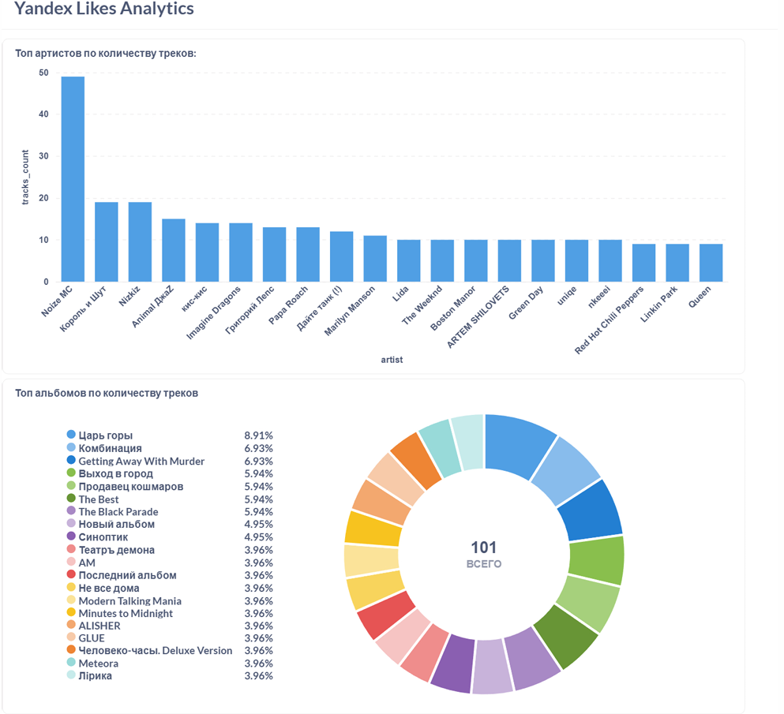

Проект **Yandex Likes ETL** автоматизирует процесс извлечения, хранения и визуализации лайков из Yandex Music. Система использует **Airflow** для автоматизации ETL, **PostgreSQL** для хранения данных и **Metabase** для визуализации дашборда.  

---

## 🎯 Цель проекта

- Скачивать понравившиеся треки пользователя с Yandex Music  
- Сохранять треки в PostgreSQL (`raw_likes`)  
- Построить дашборд с ключевой аналитикой: топ артистов, альбомов и средняя длительность треков  

---

## ⚙️ Технологии

- **Python** – для скрипта ETL  
- **Airflow** – автоматизация DAG  
- **PostgreSQL** – база данных для лайков  
- **Metabase** – визуализация дашборда  
- **Docker** – для поднятия всех сервисов

 Дашборд

